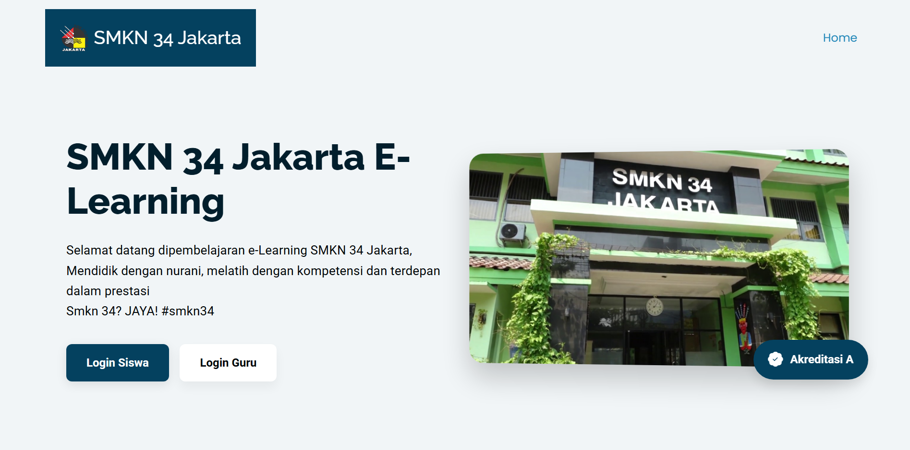
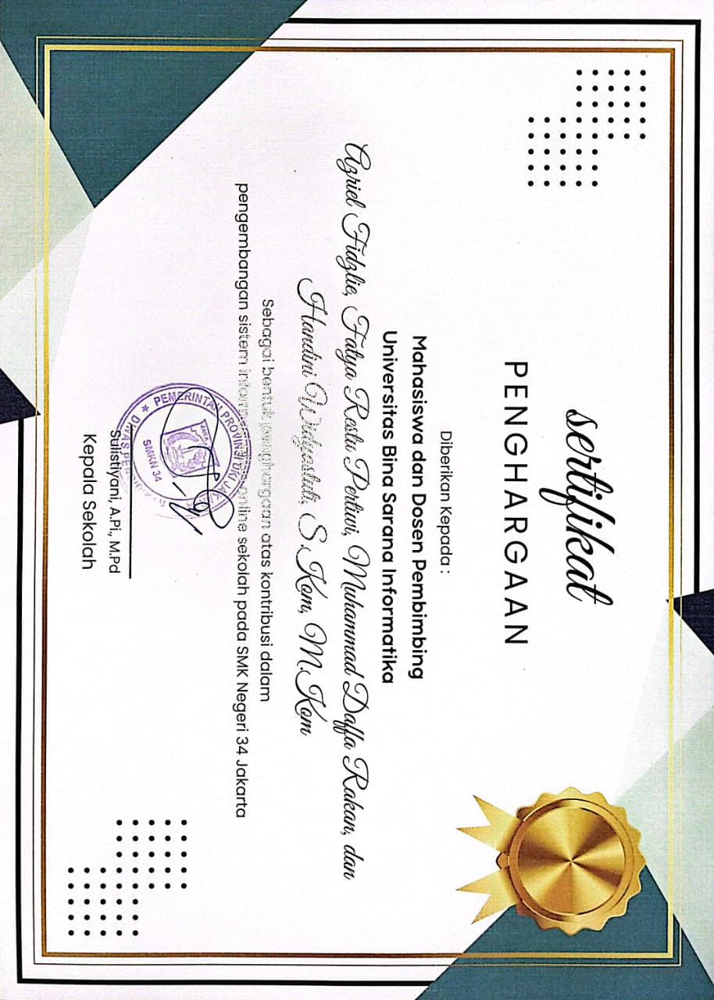
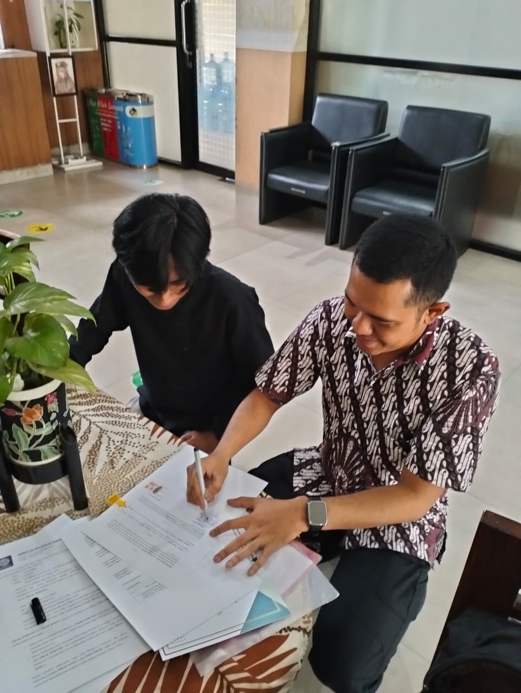
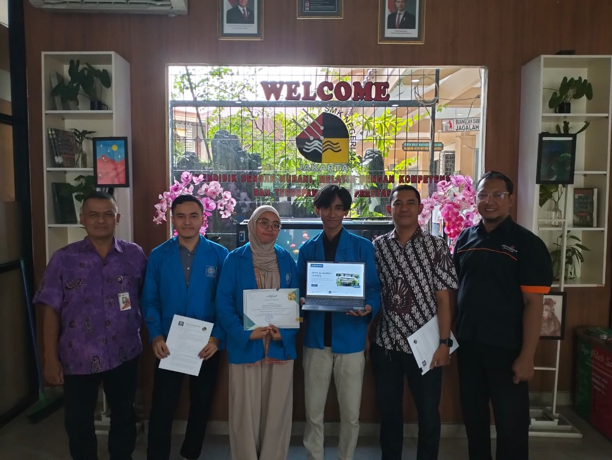

SMKN 34 Jakarta, yang berlokasi di Jl. Kramat Raya No. 93, Jakarta Pusat, adalah Sekolah Menengah Kejuruan (SMK) teknik terakreditasi A. Berdiri sejak tahun 1972, sekolah ini telah meluluskan banyak tenaga ahli dan memiliki rekam jejak yang kuat dalam menyalurkan lulusannya ke industri manufaktur serta rekayasa terkemuka.

## Ringkasan Proyek

Proyek ini merupakan pengembangan aplikasi ujian online berbasis web (Computer-Based Test) untuk SMK Negeri 34 Jakarta. Tujuannya adalah menggantikan platform konvensional guna menghadirkan sistem evaluasi yang lebih aman, terintegrasi, dan bebas dari kecurangan akademik.

## Rumusan Masalah

Sebelumnya, kami datang ke sekolah untuk menganalisis kegiatan ujian yang saat itu masih menggunakan Google Docs. Seperti yang kita ketahui, penggunaan Google Docs untuk ujian cukup rawan terhadap aksi kecurangan. Oleh karena itu, kami berdiskusi lebih lanjut dengan pihak sekolah dan mengusulkan pembuatan aplikasi berbasis web (CBT). Tujuannya adalah menggantikan platform konvensional tersebut dengan sistem evaluasi yang lebih aman, terintegrasi, dan terhindar dari kecurangan.

## Pengembangan

Pada proyek kali ini, tim kami terdiri dari tiga orang, yaitu:

- Azriel Fidzlie (Developer dan Penulis)
- Fatya Restu Pertiwi (Penulis dan UI/UX)
- Muhammad Daffa Rakan (Penulis dan Pembuat Diagram)

Kami memulai proyek ini dengan sangat antusias karena selain sebagai syarat kelulusan program S1, kami juga berkesempatan untuk berkontribusi langsung kepada mitra dalam pengembangan sebuah website.

Kami hanya diberikan waktu selama 3 bulan untuk membuat aplikasi yang siap pakai dan dapat langsung digunakan oleh pihak sekolah. Oleh karena itu, kami memutuskan untuk menggunakan CodeIgniter 4 (CI4). Menurut kami, CI4 adalah pilihan yang tepat untuk skala sekolah dan sangat memudahkan proses pengembangan kode. Alhasil, aplikasi Ujian Online SMKN 34 Jakarta berbasis web berhasil dirampungkan tepat waktu.

Tentu saja, fase ini sangat krusial. Umpan balik dan masukan dari pihak-pihak terkait tak luput dari proses pengembangan. Kami terus berusaha setiap hari untuk mengakomodasi fitur-fitur yang belum ada pada aplikasi.

{style="width:50%;"}

Revisi demi revisi, penambahan fitur, serta perbaikan bug terus kami lakukan hingga sistem ini menjadi sebuah aplikasi utuh yang siap digunakan.

## Penyerahan Aplikasi

{style="width:80%;"}

Sertifikat penghargaan ini menjadi bukti bahwa kami telah berhasil merampungkan dan menyerahkan proyek yang kami kembangkan. Berikut adalah beberapa dokumentasi penyerahan proyek Ujian Online SMKN 34 Jakarta.

[elearningsmkn34jkt.sch.id](https://elearningsmkn34jkt.sch.id/) `(Aktif)`




