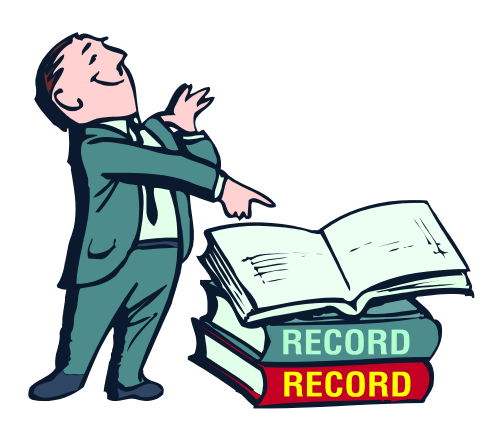

## Mengenal Diri Sendiri

")
{style="width:25%;"}

Mengenal diri sendiri adalah awal mengenal kebenaran. Socrates mengistilahkannya dengan GNOOTI SEAUTON, (know yourself). Orang perlu mengenal siapa dirinya yang sebenarnya, sehingga ia mengenal kebenaran.

{style="width:25%;"}

Kebenaran itu merupakan kacamata atau frame yang membuat orang mampu berkomunikasi dengan orang lain secara otentik, tanpa kepalsuan, tanpa topeng.

{style="width:25%;"}

Orang yang telah mengenal dirinya akan mudah mengenal orang lain. Karena mampu memahami orang lain, maka mampu menyesuaikan dirinya dengan berbagai gaya (style) orang yang berbeda. Jadinya menjadi orang yang cerdas secara personal (PQ).

### Mengenal diri berarti:

Memahami dengan baik hal-hal pokok dan penting tentang diri sendiri yang meliputi: ciri-ciri kekhasan fisik, kepribadian, watak, temparamen dan pengenalan bakat serta konsep yang jelas tentang diri sendiri dengan segala kekuatan dan kelemahannya

### Manfaat dan tujuan mengenal diri:

1. Seseorang dapat mengenal kenyataan dirinya, dan sekaligus kemungkinan-kemungkinannya, serta diharapkan mengetahui peran apa yang harus dia mainkan untuk mewujudkannya.
2. Sebaliknya, orang yang tidak mengenal dirinya, tidak mengetahui apa yang harus dikerjakan dan dikembangkannya.
3. Tidak memahami posisi diri akan membuatnya sulit mengarahkan diri kepada tujuan hidupnya, sehingga gagal dalam pergumulan hidupnya.

#### Cara Mengenal Diri:

1. Bersikap terbuka (open minded) terhadap kritik, saran orang lain, dan mau menerima apa adanya demi perkembangan dirinya; tidak defensif.
2. Melalui penelusuran bakat dan kepribadian
3. Melalui pengalaman sehari-hari
4. Melalui kebersamaan dengan orang lain
5. Melalui refleksi dan perenungan diri pribadi merumuskan potret diri sendiri.

## Orang Cacat Fisik Bisa Sukses

Beberapa contoh:

- Nick Vujicic (lihat cuplikan videonya)
- Forest Gump (lihat cuplikan videonya)
- Tony Melendes (lihat cuplikan videonya)

### Forest Gump Orang Cacat yg Sukses

## Kesimpulan

1. Pengenalan akan fisik menyadarkan diri untuk menerima diri apa adanya
2. Dengan penerimaan diri orang bisa sukses karena ia mau mengembangkan diri berangkat dari yang ada padanya, tidak menyalahkan keadaan fisiknya.
3. Menjadi percaya diri, mampu berusaha, menjadi berkah bagi sesama.

## Memahami Temperamen

Ada 4 (empat) jenis temperamen:

1. Sanguinis
2. Koleris
3. Melankolis
4. Phlegmatis

---

1. Dalam kenyataan orang tidak hanya memiliki satu temperamen, sering ada perpaduan: sankol, sanmel, san phleg, kolsan, kolmel, kolphleg, melsan, melphleg, phlegsan, phlegkol, dan phlegmel.
2. Mungkin juga perpaduan lebih dari itu
3. (Bisa dilanjut dengan latihan mengenal tipe kepribadian ala MBTI)

---

## Kepribadian/Watak/Temperamen

1. Kepribadian

   Adalah organisasi dinamis di dalam individu yang terdiri dari sistem-sistem psikofisik yang menentukan tingkah laku dan pikirannya secara karakteristik dalam menyesuaikan diri terhadap lingkungan (**G. Allport**)

2. Watak

   Adalah totalitas dari keadaan-keadaan dan cara bereaksi jiwa terhadap perangsang. (**G. Ewald**) Secara teoritis, watak dibedakan (**G. Ewald**)

   a. Watak yang dibawa sejak lahir

   b. Watak yang diperoleh

3. Temperamen

   Adalah gejala karakteristik daripada sifat emosi individu, termasuk juga mudah tidaknya terkena rangsangan emosi, kekuatan serta kecepatannya bereaksi, kualitas kekuatan suasana hatinya, segala cara daripada fluktuasi dan intensitas suasana hati. Gejala ini bergantung pada faktor konstitusional dan karenanya terutama berasal dari keturunan (**Allport**)

Mengenal Bakat

Pengertian Bakat

1. Bakat merupakan potensi yang dimiliki oleh seseorang sebagai bawaan sejak lahir.
2. Bakat adalah kemampuan khusus yang memungkinakan seseorang memperoleh keuntungan dari hasil pelatihannya sampai suatu tingkat tinggi
3. Bakat masih harus diwujudkan dengan cara kita menggali dan mengembangkan
4. Bakat merupakan karakteristik unik individu

Hal-hal yang mempengaruhi bakat

1. Unsur genetik
2. Latihan
3. Struktur tubuh

Kecerdasan Sebagai Bakat

Jenis kecerdasan menurut Howard Gardner:

1. Kecerdasan linguistik
2. Kecerdasan logis-matematis
3. Kecerdasan spasial
4. Kecerdasan musikal
5. Kecerdasan kinestetik-jasmani
6. Kecerdasan antarpribadi
7. Kecerdasan intrapribadi
8. Kecerdasan Naturalis

Mengembangkan kekuatan dan mengatasi kelemahan diri sendiri:

1. Introspeksi diri
2. Mengendalikan diri
3. Membangun kepercayaan diri
4. Mengenal dan mengambil inspirasi dari tokohtokoh teladan
5. Berpikir positif & optimis tentang diri sendiri
