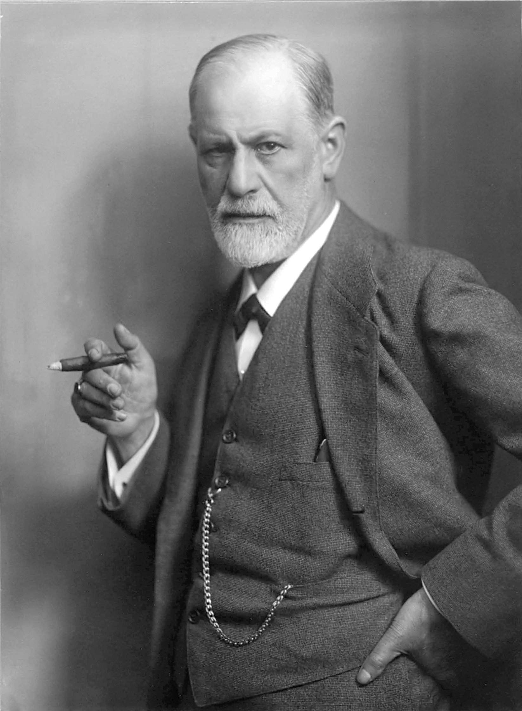
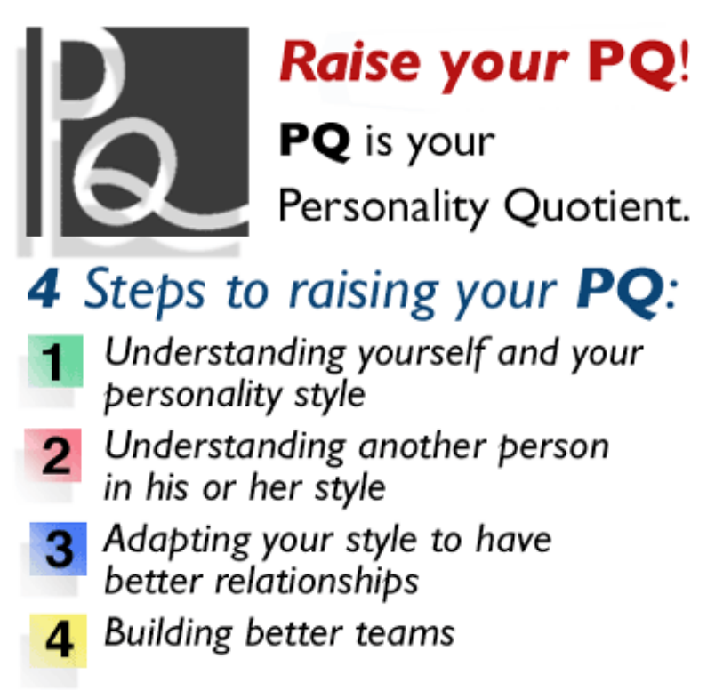
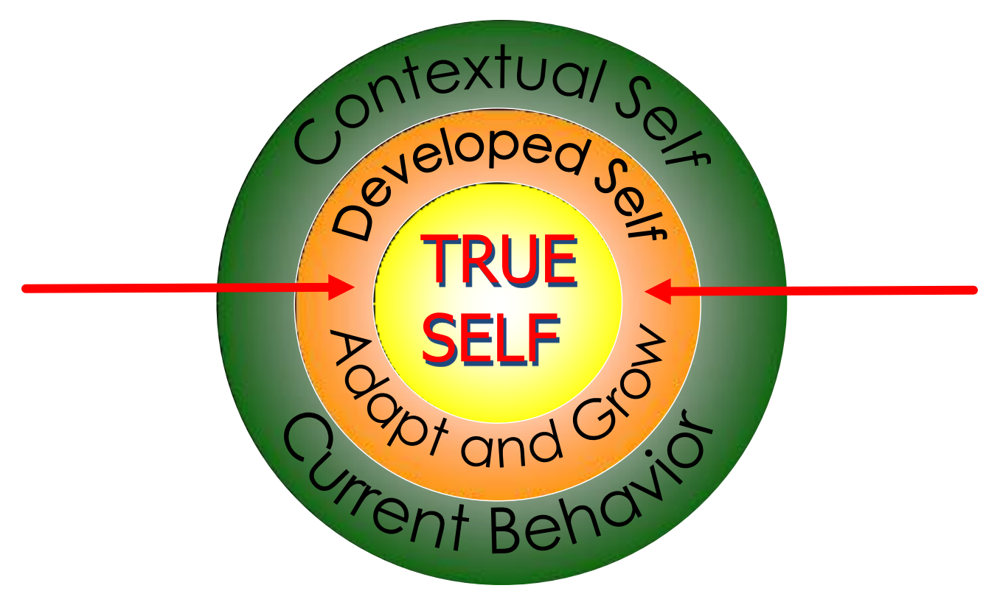

## Menerima Diri

")
{style="width:25%;"}

Ingin mengetahui bagaimana cara membantu manusia untuk “mengenal dirinya” secara akurat, lebih obyektif dan mendalam.

")
{style="width:25%;"}

Pada waktu itu, Jung sudah mengetahui pendapat Sigmund Freud, yang mengatakan bahwa perilaku manusia disebabkan oleh obyek.

")
{style="width:25%;"}

Jung juga sudah tahu pendapat Alfred Adler tentang perilaku manusia yang mengatakan bahwa "agen penentu perilaku manusia berada di dalam subyek itu sendiri".





Jung melihat bahwa apa yang dikemukakan Freud dan Adler sebenarnya sama, hanya satu melihat dari sudut “ekstrovert” (Freud) dan yang lain dari sudut “introvert” (Adler).

Jung melakukan penelitian dan observasi atas berbagai corak kepribadian manusia selama 20 tahun lebih, hingga akhirnya ia mengemukakan penggolongan manusia atas tipe-tipe kepribadian: Ektrovert, Introvert, Thinking, Feeling.

 bersama ibunya Katharyn Briggs (1875 – 1968)")
{style="width:50%;"}

mempelajari teori Jung dan selama 40 tahun melakukan pengamatan tipe-tipe kepribadian manusia berdasar pada teori Jung tersebut.

Mereka akhirnya membuat sebuah psikotest yang dapat menggolongkan manusia dalam tipe-tipe kepribadian, sesuai dengan teori Jung. Demikian lahirlah test: Myers Briggs Type Indicator (MBTI).

Myers dan Briggs memperkuat dan memperluas temuan Carl Gustav Jung mengenai: ektrover-introver, penginderaan-intuitif, berpikir-perasa, dan penilai-pengamat

Kombinasi dari keempat preferensi di atas menghasilkan 16 tipe kepribadian manusia, yang mengandung potensi, bakat dan talenta, sekaligus kelemahan-kelemahan yang terkandung di dalamnya.

Pernahkah kalian membanding-bandingkan diri sendiri dengan orang lain, misalnya, kenapa aku tidak secantik kakakku, atau kenapa aku tidak sepandai temanku, dsb.

Pernahkah kalian berandai-andai, misalnya kalau saja saya secantik dia, kalau saja saya sepintar dia, betapa bahagianya saya

Umumnya orang yang membandingkan dirinya dengan orang lain cenderung melihat dirinya berada pada pihak yang kurang beruntung, sedangkan orang lain sebagai pihak yang beruntung, bernasib baik, bahagia, dsb.

### Pengertian Menerima Diri

Menerima Diri adalah dimana kita menerima segala kelemahan dan kelebihan kita atau menerima segala sesuatu yang ada didalam diri kita, menerima segala hal yang telah terjadi dalam kehidupan dan diri kita. Sehingga sikap kita memandang diri sendiri sebagaimana adanya dan mempermalukan diri kita secara baik disertai rasa syukur, senang dan bangga sambil terus mengusahakan kemajuan.

### Bahaya Menolak Diri Sendiri

Akibat membanding-bandingkan diri sendiri dengan orang lain membuat kita lupa melihat diri kita sendiri

Kecewa dengan diri sendiri dan putus asa

> Kita adalah kita seperti apa adanya, tetapi kita tidak terus seperti itu, kita harus berkembang

### Cara-Cara Untuk Menerima Diri Sendiri

1. Gunakan kacamata paradigma baru
2. Tetapkan standar atau target yang realistis
3. Luangkan waktu Bersama orang-orang positif
4. Membaca buku-buku pengembangan diri
5. Lakukan sesuatu yang membuat Anda lebih menyukai diri Anda.
6. Gunakan kata-kata yang positif pada diri sendiri.
7. Bersyukurlah dengan apa yang Anda miliki.

### Manfaat Menjadi Diri Sendiri

- Pikiran menjadi jernih
- Menikmati hidup
- Mengetahui potensi diri dengan mudah
- Mencapai kesuksesan

{style="width:50%;"}

RAISING YOUR PERSONALITY QUOTIENT, INDIVIDUALS, TEAMS and ORGANIZATIONS

### Cara Memahami Diri

### Perbedaan Preferensi


flowchart LR
%% Kategori 1: E vs I
E([<u>E</u>xtravert]) -.- I([<u>I</u>ntrovert])

    %% Kategori 2: S vs N
    S([<u>S</u>ensing]) -.- N([i<u>N</u>tuition])

    %% Kategori 3: T vs F
    T([<u>T</u>hinking]) -.- F([<u>F</u>eeling])

    %% Kategori 4: J vs P
    J([<u>J</u>udging]) -.- P([<u>P</u>erceiving])

    %% Styling Warna (sesuai gambar)
    classDef extra fill:#fbc02d,stroke:#f57f17,stroke-width:1px,color:black,font-size:18px;
    classDef intro fill:#f57c00,stroke:#e65100,stroke-width:1px,color:white,font-size:18px;

    classDef sens fill:#c8e6c9,stroke:#81c784,stroke-width:1px,color:black,font-size:24px,font-weight:bold;
    classDef intu fill:#00e676,stroke:#00c853,stroke-width:1px,color:black,font-size:24px,font-weight:bold;

    classDef thin fill:#90caf9,stroke:#42a5f5,stroke-width:1px,color:black,font-size:24px,font-weight:bold;
    classDef feel fill:#2979ff,stroke:#2962ff,stroke-width:1px,color:black,font-size:24px,font-weight:bold;

    classDef judg fill:#f48fb1,stroke:#d81b60,stroke-width:1px,color:black,font-size:18px;
    classDef perc fill:#880e4f,stroke:#4a148c,stroke-width:1px,color:white,font-size:24px,font-weight:bold;

    %% Penerapan Style
    class E extra;
    class I intro;
    class S sens;
    class N intu;
    class T thin;
    class F feel;
    class J judg;
    class P perc;



### 16 Gambaran Tipe


block-beta
columns 4

    %% Baris 1
    ISTJ ISFJ INFJ INTJ

    %% Baris 2
    ISTP ISFP INFP INTP

    %% Baris 3
    ESTP ESFP ENFP ENTP

    %% Baris 4
    ESTJ ESFJ ENFJ ENTJ

    %% Styling warna blok sesuai dengan grup kepribadian
    %% SJ (Kuning)
    classDef sj fill:#d6d688,stroke:#f5f5f5,stroke-width:3px,color:black,font-size:20px,font-weight:bold;
    %% SP (Perunggu/Cokelat Muda)
    classDef sp fill:#c79a52,stroke:#f5f5f5,stroke-width:3px,color:black,font-size:20px,font-weight:bold;
    %% NF (Biru)
    classDef nf fill:#79a2db,stroke:#f5f5f5,stroke-width:3px,color:black,font-size:20px,font-weight:bold;
    %% NT (Hijau Mint)
    classDef nt fill:#9ad3a5,stroke:#f5f5f5,stroke-width:3px,color:black,font-size:20px,font-weight:bold;

    %% Terapkan style ke masing-masing kotak
    class ISTJ,ISFJ,ESTJ,ESFJ sj;
    class ISTP,ISFP,ESTP,ESFP sp;
    class INFJ,INFP,ENFP,ENFJ nf;
    class INTJ,INTP,ENTP,ENTJ nt;



Tipe tidak kaku mengkotak-kotakkan pribadi seseorang

### Perlu Diingat

- Tiap tipe adalah unik dan istimewa; tidak ada yang benar atau salah.
- Setiap orang menggunakan semua preferensi pada tingkatan tertentu.
- Tipe tidak menjelaskan segalanya.
- MBTI tidak mengukur keterampilan atau kemampuan.
- Sebaiknya tidak membatasi anda dalam mempertimbangankan karir, aktivitas, atau suatu hubungan.
- Sadari bias dari tipe anda untuk menghindari stereotipi yang negatif.

## ISTJ

### Pengindra Yang Introver Dengan Berpikir Sebagai Pembantu

- Serius dan pendiam, menyukai situasi yang tenang dan aman
- Sangat berhati-hati, sistematis, bertanggung jawab dan dapat diandalkan.
- Memiliki konsentrasi yang tinggi, memegang teguh pada tradisi
- Teratur, pekerja keras, fokus pada target yang ingin dicapai
- Jika sudah mempersiapkan diri, bisa langsung menyelesaikan tugas

## ISTP

### Berpikir Yang Introver Dengan Pengindra Sebagai Pembantu

1. Pendiam, lebih suka sendiri, tertarik pada ‘bagaimana’ dan ‘mengapa’ sesuatu bisa terjadi
2. Trampil pada hal-hal yang bersifat mekanis - praktis
3. Berani mengambil resiko jangka pendek
4. Biasanya menyukai olah raga yang mengandung bahaya
5. Loyal pada kelompok dan ‘sistem nilai’ yang berlaku
6. Kurang peduli pada aturan dalam menyelesaikan sesuatu.
7. Pandai menemukan solusi dari masalah-masalah praktis

## ISFJ

### Pengindra Yang Introver Dengan Perasa sebagai Pembantu

- Baik hati, pekerja keras dan dapat diandalkan.
- Lebih mengutamakan kebutuhan orang lain
- Bertanggung jawab, menghargai tradisi dan keajegan
- Menyukai hal-hal yang praktis dan serba pasti
- Sadar akan posisi dan peran/fungsinya
- Suka mengamati orang lain
- Sangat peka terhadap perasan orang lain dan suka melayani

## ISFP

### Perasa Yang Introver Dengan Pengindra Sebagai Pembantu

1. Pendiam, serius, sensitif dan baik hati.
2. Tidak menyukai konflik
3. Loyal, jujur dan realistis
4. Menyukai kecantikan dan keindahan
5. Tidak tertarik untuk memegang peranan sebagai pimpinan/atasan
6. Fleksibel dan ‘open minded’.
7. Apa adanya dan kreatif
8. Menikmati ‘saat ini’

## INFJ

### Intuitif Yang Introver Dengan Perasa Sebagai Pembantu

1. Pemikir, banyak ide dan dinamis
2. Cenderung terpaku pada satu hal sampai benar-benar selesai
3. Sangat peka terhadap orang lain dan peduli pada perasaan mereka
4. Sangat memegang teguh pada ‘sistem nilai’ yang diyakininya.
5. Selalu ingin melakukan sesuatu dengan benar
6. Cenderung bekerja sendiri daripada mengambil peran sebagai pimpinan atau pengikut

## INFP

### Perasa Yang Introver Dengan Intuisi Sebagai Pembantu

1. Pendiam, pemikir, dan idealis.
2. Tertarik untuk masalah kemanusiaan, selalu ingin membantu
3. Memiliki ‘sistem nilai’ yang kuat
4. Sangat loyal
5. Mudah menyesuaikan diri, kecuali bertentangan dengan ‘sistem nilai’ yang dianut
6. Biasanya mempunyai bakat sebagai penulis
7. Cepat melihat banyak kemungkinan

## INTJ

### Intuitif Yang Introver Dengan Berpikir Sebagai Pembantu

1. Mandiri, ‘orisinal’, analitis dan tegas.
2. Ahli dalam menerjemahkan sebuah konsep/teori kedalam tindakan nyata
3. Sangat menghargai ilmu, kompetensi dan struktur
4. Berpikir jangka panjang
5. Menetapkan standar yang tinggi, baik bagi diri sendiri maupun orang lain
6. Secara spontan tampil sebagai pemimpin , tetapi akan patuh pada pimpinan yang ia hormati

## INTP

### Berpikir Yang Introver Dengan Intuisi Sebagai Pembantu

1. Logis, ‘orisinil’ dan pemikir yang kreatif
2. Bisa sangat bermanfaat akan teori maupun ide-ide
3. Ahli dalam menjelaskan sebuah teori sehingga mudah dipahami
4. Sangat menghargai ilmu, kompetensi dan logika
5. Cenderung diam, lebih suka sendiri, agak sulit akrab
6. Kurang tertarik untuk menjadi pemimpin atau pengikut

## ESTP

### Pengindra Yang Ekstrover Dengan Berpikir Sebagai Pembantu

1. Bersahabat, mudah menyesuaikan diri dan cepat bertindak
2. ‘Pelaksana’, fokus pada hasil yang nyata
3. Hidup untuk saat ini dan sekarang, berani mengambil resiko dalam waktu singkat
4. Tidak sabar menghadapi penjelasan yang panjang lebar dan teoritis
5. Sangat loyal pada kelompoknya, namun tidak begitu peduli pada aturan jika sedang ingin melakukan sesuatu
6. Pandai bergaul dan bersosialisasi

## ESTJ

### Berpikir Yang Ekstrover Dengan Pengindra Sebagai Pembantu

1. Praktis, terorganisir, dan menghargai tradisi
2. Tidak tertarik pada teori atau hal-hal yang abstrak kecuali jika bisa diterapkan
3. Punya gambaran yang jelas tentang bagaimana cara mengerjakan sesuatu
4. Loyal dan pekerja keras
5. Bertanggung jawab
6. Ahli dalam mengatur dan menjalankan sesuatu
7. ‘Warga negara’ yang baik, menghargai kehidupan yang aman dan tenang

## ESFP

### Pengindra Yang Ekstrover Dengan Perasa Sebagai Pembantu

1. Orientasi pada orang, menikmati hidup, membuat segala sesuatu menjadi lebih seru dan ‘hidup’
2. Hidup untuk saat ini, menyukai pengalaman baru
3. Tidak menyukai teori dan analisa yang impersonal.
4. Suka melayani dan membantu orang lain.
5. Suka untuk menjadi pusat perhatian
6. ‘Memiliki ‘common sense’ yang baik

## ESFJ

### Perasa Yang Ekstrover Dengan Pengindra Sebagai Pembantu

1. Hangat, populer dan berhati-hati
2. Lebih mengutamakan kebutuhan orang lain
3. Punya rasa tanggung jawab yang besar Menghargai tradisi
4. Suka melayani orang lain
5. Membutuhkan dukungan yang positif dari orang lain
6. Sadar akan peran dan fungsinya

## ENFP

### Intuitif Yang Ekstrover Dengan Perasa Sebagai Pembantu

1. Antusias, idealis dan kreatif
2. Serba bisa
3. Pandai bergaul dan bersosialisasi
4. Menjalani hidup sesuai dengan ‘sistem nilai’ yang dianut
5. Sangat bersemangat dengan ide-ide baru, tetapi mudah bosan dengan hal-hal kecil
6. ‘Open- minded’ dan fleksibel dengan kemampuan dan minat yang luas

## ENFJ

### Perasa Yang Ekstrover Dengan Intuisi Sebagai Pembantu

1. Popular dan sensitif, mudah bergaul dan bersosialisasi
2. Fokus pada dunia eksternal, sangat peduli pada apa yang dirasakan dan dipikirkan orang lain
3. Melihat segala sesuatunya dari sudut pandang yang manusiawi, tidak menyukai analisa yang impersonal
4. Efektif dalam menyelesaikan masalah yang berkaitan dengan manusia
5. Suka melayani orang lain, dan lebih mengutamakan kebutuhan orang lain

## ENTP

### Intuitif Yang Ekstrover Dengan Berpikir Sebagai Pembantu

1. Kreatif, dapat berpikir dengan cepat, imajinatif
2. Serba bisa
3. Suka berdebat
4. Sangat bersemangat dengan ide-ide dan proyek baru, namun cenderung mengabaikan hal-hal yang rutin
5. Jujur, terbuka dan asertif
6. Ahli dalam memahami konsep dan menerapkan logika dalam mencari solusi

## ENTJ

### Berpikir Yang Ekstrover Dengan Intuisi Sebagai Pembantu

1. Asertif dan jujur, terdorong untuk memimpin
2. Ahli dalam memahami masalah organisasi yang sulit, dan memberikan solusi yang solid
3. ‘Cerdas’ dan punya banyak pengetahuan, biasanya pandai berbicara di depan umum
4. Sangat menghargai ilmu dan kompetensi, bisanya tidak sabar terhadap sesuatu yang tidak efisien atau tidak terorganisir dengan baik

## ISTJ/SISTEMATIS

Tuhan, bantulah aku untuk mulai rileks, tentang detail pekerjaanku besok pukul 11:41:32

## ISFJ/CERMAT

Tuhan, tolonglah aku agar lebih tenang dan santai, dan bantulah aku agar mampu membuatnya dengan tepat.

## INFJ/PERFEKSIONIS

Tuhan, bantu agar aku jangan perfeksionis. Apakah aku sudah mengeja “istilah”nya dengan tepat?

## INTJ/MANDIRI

Tuhan, bantulah aku agar bisa terbuka terhadap ide-ide orang lain, sekalipun mungkin ide itu salah barangkali.

## ISTP/Kritis

Tuhan, bantulah aku untuk memperhatikan perasaan orang lain, sekalipun perasaan mereka hiperaktif.

## ISFP/LEMBUT

Tuhan, bantulah aku untuk mempertahan “hak” ku, bila Tuhan tidak keberatan hal itu aku memohonnya.

## INFP/FLEKSIBEL

Tuhan, bantulah aku menyelesaikan segala sesuatu yang telah aku mulai.

## INTP/INDEPENDEN

Tuhan, bantulah aku untuk sedikit kurang independen, namun biarlah aku melakukannya dengan caraku sendiri.

## ESTP/PRAGMATIS

Tuhan, bantulah aku untuk bertanggung jawab atas tindakan-tindakanku sekalipun hal-hal yang tidak kusengaja.

## ESFP/Ramah

Tuhan, bantulah aku untuk menangani segala sesuatu lebih serius, lebih khusus pesta dan hurahura.

## ENFP/ANTUSIAS

Tuhan, bantulah aku untuk tetap memusatkan perhatianku pada satu hal. Oh, tapi lihatlah ada burung yang sedang terbang.

## ENTP/INOVATIF

Tuhan, bantulah aku menetapkan prosedur kerjaku hari ini. Tapi tunggu sebentar, aku sesuaikan dulu beberapa menit saja.

## EATJ/ANALISIS

Tuhan, bantulah aku untuk tidak mencoba mengerjakan segala sesuatu. Namun, bila Tuhan membutuhkan bantuanku, minta saja, akan aku coba bantu.

## ESFJ/PENOLONG

Tuhan, berilah aku kesabaran, dan aku sungguh membutuhkan sekarang juga.

## ENFJ/TOLERAN

Tuhan, bantulah aku melakukan hal yang dapat kulakukan,dan mempercayakan sisanya padaMu. Apakah Tuhan tidak keberatan untuk membuat perjanjian ini secara tertuli?

## ENTJ/Organisir

Tuhan,bantulah aku agar bisa menjalankan suatu secara pelan-pelan, dan tidak selalu tergesa-gesa dan terburu-buru. Amin.
