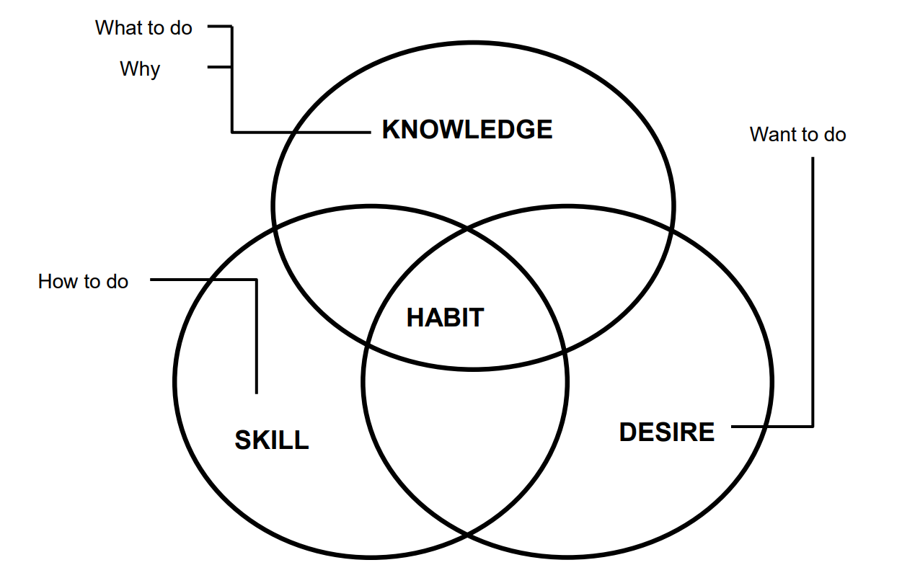
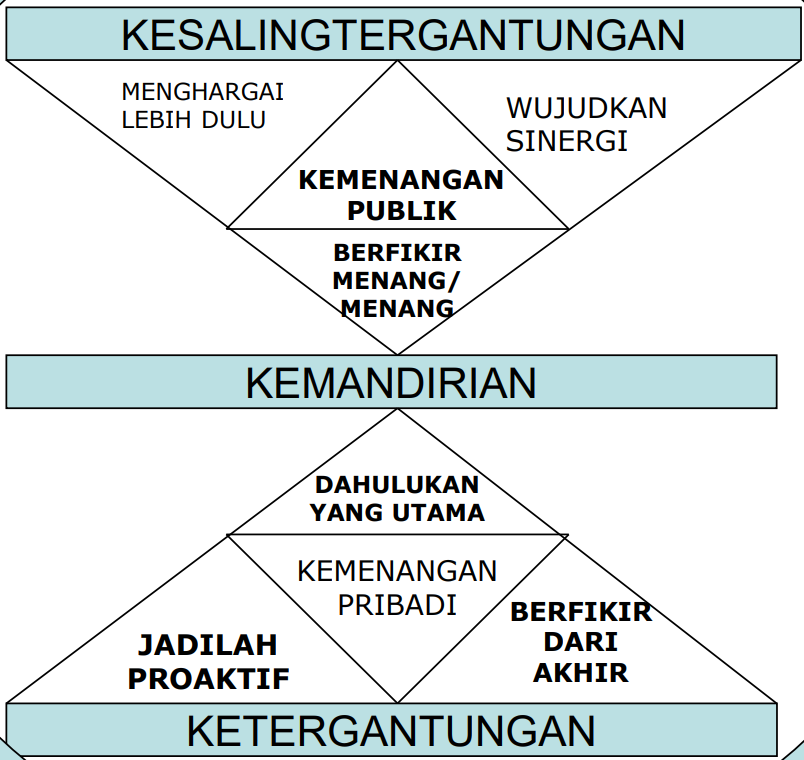
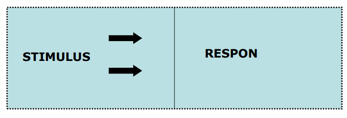
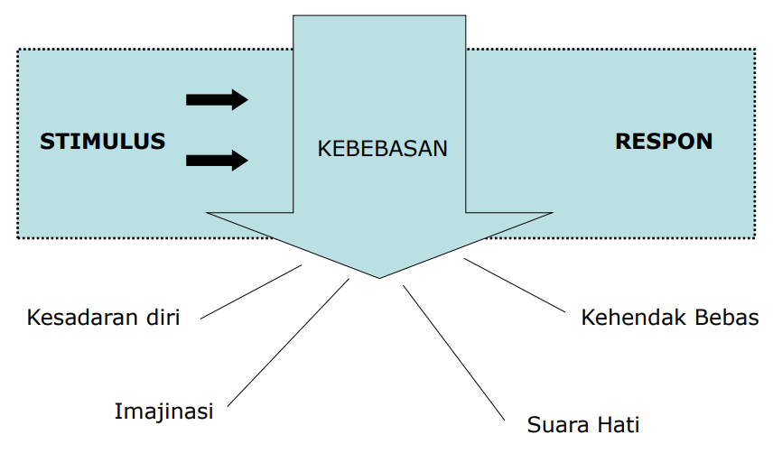
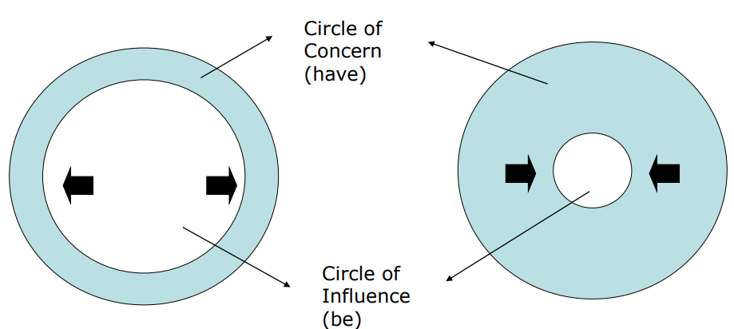
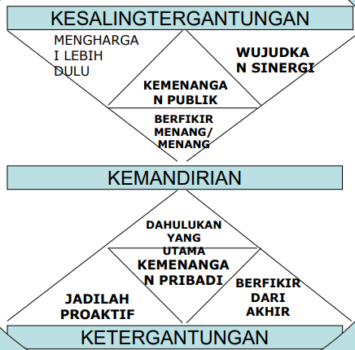

## Mengembangkan Diri

### Arti dan Tujuan Mengembangkan Diri

Arti mengembangkan diri adalah:

Suatu usaha sengaja dan terus menerus, tanpa henti, yang dilakukan dengan berbagai cara dan bentuk, untuk membuat daya-potensi diri (jasmani rohani) dapat terwujud secara baik dan optimal, yang menghantar seseorang pada taraf kedewasaan sesungguhnya. Usaha besar ini merupakan konsekuensi dari kedudukannya sebagai manusia, yang diberi akal budi

Tujuan yang ingin dicapai dengan usaha pengembangan diri ini adalah:

Realisasi optimal ke arah yang baik dari daya potensi yang dimiliki diri sendiri, (jasmani rohani), yang menghantar seseorang pada tingkat matang dewasa, yang membuat dia sanggup membangun relasi yang semakin baik dengan dirinya, dunia, sesama dan Tuhan.

Usaha ini melibatkan diri manusia sepenuhnya dan menggunakan daya dukung yang tersedia baginya.

Cara Mengembangkan Diri

1. Mengenal dan menerima diri
2. Memiliki kemauan kuat untuk mengembangkan diri
3. Memanfaatkan kemungkinan yang terbuka
4. Belajar dari kesalahan

Hal-hal penting yang perlu dikembangkan sebagai bentuk konkrit pengembangan diri sendiri adalah:

1. Mental yang sehat
2. Integritas diri
3. Mandiri, kreatif, dan inovatif
4. Motivasi diri

### Kekuatan dan Ketahanan Mental

Pemaparan yang disajikan berikut ini diambil dari buku Adversity Quotient, Mengubah Hambatan Menjadi Peluang, karangan Paul G. Stolz, 2000.

1. Adversity Quotient (AQ): Penentu utama untuk sukses
2. Quitters, Campers, dan Climbers
3. Adversity Response Profile (ARP): Kemampuan menghadapi Masalah dan Merespon serta menghadapi setiap permasalahan.

### Definisi Adversity Quotient (AQ)

Setelah 19 tahun melewati penelitian yang panjang & mengkaji lebih dari 500 referensi, Paul G. Stoltz mengemukakan satu kecerdasan baru selain IQ, EQ, SQ yakni AQ.

Menurutnya, AQ adalah kecerdasan untuk mengatasi kesulitan. Bagaimana mengubah hambatan menjadi peluang. Atau dengan kata lain, seseorang yang memiliki AQ tinggi akan lebih mampu mewujudkan cita-citanya dibandingkan orang yang AQ-nya rendah.

Sebagai gambaran, Stoltz memakai terminologi para pendaki gunung. Dalam hal ini, Stoltz membagi para pendaki gunung menjadi tiga bagian:

1. Quitter (yang menyerah). Para quitter adalah mereka yang sekadar bertahan hidup. Mereka mudah putus asa dan menyerah di tengah jalan.
2. Camper (berkemah di tengah perjalanan) Mereka berani melakukan pekerjaan yang berisiko, tetapi risiko yang aman dan terukur. Cepat puas, dan berhenti di tengah jalan.
3. Climber (pendaki yang mencapai puncak). Berani menghadapi risiko dan menuntaskan pekerjaannya.

Untuk dunia pekerjaan dan kehidupan sangatlah jelas. Banyak pekerja yang intelektualnya (IQ) rendah bisa saja mengalahkan mereka yang ber IQ tinggi tetapi tidak punya semangat dan keberanian untuk menghadapi masalah dan bertindak. Dengan AQ dapat dianalisis bagaimana para karyawan / pekerja mampu mengubah tantangan menjadi sebuah peluang yang akan meningkatkan produktifitas dan keuntungan perusahaan.

Itu tadi uraian singkat tentang Adversity Quotient. Bagaimana dengan Anda?

**“winner never quits and quitter never wins”** 
“Pemenang tidak pernah menyerah dan orang yang gampang menyerah tidak pernah menang"

David Cambell Ph.D menyatakan bahwa kreativitas adalah kegiatan yang mendatangkan hasil dengan kandungan ciri:

1. inovatif
2. berguna
3. dapat dimengerti

## Mengembangkan Diri Menjadi Pribadi Yang Tangguh Dengan 7 Kebiasan Pribadi Yang Efektif

{style="width:75%;"}

### Watak Adalah Himpunan Dari Berbagai Kebiasaan

#### Apa itu pribadi efektif?


flowchart LR
%% Node Induk
PRIBADI["PRIBADI"]

    %% Node Watak (Kotak biru muda, teks list di bawahnya)
    WATAK["
WATAK

✓ Kualitas individu ✓ Kumpulan kebiasaan ✓ Berorientasi jangka panjang
"]

    %% Node Penampilan (Kotak teal kehijauan, teks list di bawahnya)
    PENAMPILAN["
PENAMPILAN

✓ Perilaku : citra publik ✓ Tata busana ✓ Teknik bergaul ✓ Berorientasi jangka pendek
"]

    %% Hubungan Panah
    PRIBADI --> WATAK
    PRIBADI --> PENAMPILAN

    %% Styling: Menghilangkan kotak bawaan Mermaid supaya desain HTML-nya yang muncul
    classDef rootNode fill:none,stroke:none,font-size:28px,font-weight:bold;
    classDef clearNode fill:none,stroke:none;

    class PRIBADI rootNode;
    class WATAK,PENAMPILAN clearNode;



### Efektivitas (Angsa Dan Telur Emas)

- Pribadi Efektif, Bila P/PC Seimbang
- P = Produk (Telur Emas)
- PC = Kemampuan Berproduksi (Angsa)

### Efektif

- Mencapai Hasil
- Tumbuh Berkembang

#### Apa yang berkembang? Aset kita

- Phisik : rumah, kendaraan, perabot, dll
- Finansial : uang, tabungan, dll
- Manusia : Badan, pikiran, emosi

#### Bagaimana caranya?

Menyeimbangkan antara:

Produksi dan Kapasitas produksi 
_(Aesop: The goose and the golden eggs)_

### Mengubah paradigma

- Mengubah cara pandang dari yang biasa menjadi lebih lengkap dan berguna
- Mengubah perilaku dan sikap sejalan dengan cara pandang yang baru
- Berhenti melakukan kebiasaan-kebiasaan lama
- Menyelaraskan peta (sistem nilai) dengan kompas (correct principles)

#### Falsafah Bergaji

{style="width:75%;"}

## Habit 1 - Be Proactive

Principles of Personal Vision

### Model Reaktif

### Model Proaktif

### Menjadi Proaktif

- Mengambil inisiatif # agresif jangan menunggu, lakukan sesuatu
- Bertindaklah, jangan sampai disuruh bertindak
- Jadilah bagian dari solusi, bukan bagian dari masalah
- Jangan berkata: tidak bisa, harus, seandainya, 
  tetapi berkatalah : saya memilih, lebih suka, mau

### Proaktif = Bertanggung Jawab

- Tidak menyalahkan keadaan
- Tidak menyalahkan lingkungan

---

- **Hasil dari pilihan secara sadar**
- **Berdasarkan sistem nilai (values)**

---

### Lingkaran Pengaruh

Circle of influence Vs Circle of Concern

### Orang Proactive

- Perbuatannya Terkendali
- Bertanggung Jawab
- Fokus Pada “Circle Of Influence”
- Kerja Tuntas
- TIdak Defensif

## Habit 2 - Begin with the End in Mind

Principles of Personal Leadership

### Personal Leadership


flowchart BT
%% Node Bawah
I["imajinasi"]
S["suara hati"]

    %% Node Atas
    T["Segala Sesuatu Diciptakan Dua Kali (All Things are Created Twice)"]

    %% Alur Panah
    I --> T
    S --> T

    %% Styling Text Only (Tanpa Kotak)
    classDef textOnly fill:none,stroke:none,color:#fff;
    classDef topText fill:none,stroke:none,font-weight:bold,color:#fff;

    class I,S textOnly;
    class T topText;



### Hasil Kebiasaan 2

- Punya Arah Dalam Hidup
- Merencanakan Setiap Kegiatan
- Memelihara Fokus Jangka Panjang
- Memberi Arah Pada Kelompok Kerja

### Menggali Misi Pribadi

Personal Mission Statement:

- Apa Tujuan Hidup Sata?
- Apa Hal Yang Paling Bernilai Dalam Hidup Saya?
- Bakat Apa Yang Saya Miliki?
- Apa Yang Ingin Saya Capai Di Akhir Hidup Saya?

Pentingnya Memahami Peranan Kita

- PMS dibuat dengan menjabarkan Peranan
- Peranan adalah kunci menciptakan keseimbangan hidup
- Dalam setiap Peranan ada Sasaran
- Sasaran : Jangka pendek, menengah, panjang
- Sasaran harus sesuai PMS

### Cara Membuat Misi Pribadi (PMS)

- Tentukan siapa / hal-hal yang mempengaruhi hidup kita
- Tentukan Peranan Hidup Anda (dalam keluarga, sekolah/kantor, sosialmasyarakat)
- Apakah Anda puas dengan kenyataan tsb?
- Tentukan Anda ingin jadi siapa?
- Tulis draft PMS (lalu revisi, evaluasi)

## Habit 3 - Put First Things First

Principles of Personal Management


block-beta
columns 7

    %% Label Header Atas
    space:1
    Col1["Mendesak"]:3
    Col2["Tidak Mendesak"]:3

    %% Baris Pertama (Penting)
    Row1["Penting"]:1
    Q1["I. KRISIS Masalah mendesak Proyek yang waktu penyelesaiannya sudah dekat"]:3
    Q2["II. KEGIATAN TP PERENCANAAN Membina hubungan Melakukan persiapan Mencegah krisis"]:3

    %% Baris Kedua (Tidak Penting)
    Row2["Tidak Penting"]:1
    Q3["III. Rapat-rapat Hal-hal mendesak Kegiatan reguler"]:3
    Q4["IV. MENGULUR WAKTU Surat dan telepon yang tidak relevan Nonton TV"]:3

    %% Styling
    classDef noBox fill:none,stroke:none,font-weight:bold,font-size:18px,color:#000;
    classDef gridBox fill:#e0f7fa,stroke:#000,stroke-width:2px,color:#000,font-weight:bold,font-size:16px,line-height:1.5;

    class Col1,Col2,Row1,Row2 noBox;
    class Q1,Q2,Q3,Q4 gridBox;



---


block-beta
columns 4

    %% Baris Pertama
    Q1["
<b>I. Hasil</b>  ♦ Stress ♦ Burnout ♦ Krisis ♦ Mudah marah
"]:3
    Q2["
<b>II</b>      
"]:1

    %% Baris Kedua
    Q3["
<b>III</b>     
"]:3
    Q4["
<b>IV</b>     
"]:1

    %% Styling
    classDef box fill:#ffffff,stroke:#000,stroke-width:2px,color:#000,font-size:18px;
    class Q1,Q2,Q3,Q4 box;



---


block-beta
columns 2

    %% Baris Pertama
    Q1["
<b>I</b>     
"]
    Q2["
<b>II</b>     
"]

    %% Baris Kedua
    Q3["
<b>III. Hasil</b>  ♦ Fokus jangka pendek ♦ Krisis ♦ Bunglon
"]
    Q4["
<b>IV</b>     
"]

    %% Styling
    classDef box fill:#ffffff,stroke:#000,stroke-width:2px,color:#000,font-size:18px;
    class Q1,Q2,Q3,Q4 box;



---


block-beta
columns 2

    %% Baris Pertama
    Q1["
<b>I</b>       
"]
    Q2["
<b>II</b>       
"]

    %% Baris Kedua
    Q3["
<b>III</b>       
"]
    Q4["
<b>IV</b>  
<b>Hasil</b> ♦ Kurang punya rasa tanggung jawab ♦ Dipecat dari pekerjaan ♦ Sangat tergantung pada orang lain &nbsp;&nbsp;maupun lembaga

"]

    %% Styling
    classDef box fill:#ffffff,stroke:#000,stroke-width:2px,color:#000,font-size:18px;
    class Q1,Q2,Q3,Q4 box;



---


block-beta
columns 2

    %% Baris Pertama
    Q1["
      
"]
    Q2["
<b>II. Hasil</b>  ♦ Visi perspektif ♦ Keseimbangan ♦ Disiplin  
"]

    %% Baris Kedua
    Q3["
      
"]
    Q4["
      
"]

    %% Styling
    classDef box fill:#ffffff,stroke:#000,stroke-width:2px,font-size:18px;
    class Q1,Q2,Q3,Q4 box;



---

### Hasil Kebiasaan 3

- Fokus pada hal (Issue) prioritas
- Disiplin
- Menghindari Krisis
- Mendelegasikan Tugas
- Mengkoordinasikan usaha pelaksanaan tugas

### Rangkuman Kebiasaan 1,2,3

- Untuk Proaktif, Values Perlu Dirumuskan Dengan Jelas
- Penulisan Pms Fokus Pada Values
- Mencapai P-m Tergantung Pada Peran Dan Tujuan Yang Dipilih Dan Efektivitas Pencapaiannya
- Evaluasi Peran Dan Tujuan Menurut Prioritasnya

### Falsafah Bergaji

### Emotional Bank Account (EBA) (Paradigma II)

- Siapa Yang Menanam Akan Menuai
- Rekening Emosi Pada Diri Sendiri Dan Orang Lain
- Tumbuh Bila Ada “Trust”, Mati Bila Dikhianati
- Harus “Sincere” \_ Tulus
- Diharapkan Selalu Menanam Kebaikan – Amal – Cinta Kasih
- Siapa Menabur Angin Akan Menuai Badai

### Emotional Bank Account

Menanam-debet vs Menuai-kredit

EBA diisi tiap hari sedikit demi sedikit

- Cinta kasih vs iri, dengki, srei
- Memenuhi janji vs ingkar janji
- memenuhi harapan vs mengecewakan
- Jujur vs Bohong
- Setia vs Berkhianat
- Minta maaf vs Gengsi

Hukum cinta dan hukum kehidupan: Cinta tanpa syarat menimbulkan kehidupan

### 6 Sikap yang membangun EBA

- Memahami Orang Lain
- Menghargai Hal-hal Kecil
- Memelihara Komitmen
- Membuka Diri
- Menegakkan Integritas Diri
- Bersikap Rendah Hati

## Habit 4 - Think Win/win

Principles of Personal Leadership

### 6 Sikap Dasar interaksi Manusia

- W-W : Mencari kesepakatan yang saling menguntungkan dan memuaskan; bukan caraku atau caramu tapi cara yang terbaik
- W-L : Menjadi pemenang atau bintang cenderung otoriter, menunjukkan kekuasaan. Sikap ini yg paling sering dipakai
- L-W : Menjadi anak manis; ya tetapi tidak melaksanakan, makan ati
- L-L : Egois, konflik, cerai, sikap dari orang dependen atau pendiam
- Win : Mementingkan diri sendiri, tidak peduli dengan orang lain, yang penting menang
- No deal: sepakat untuk tidak sepakat, tidak ada harapan apapun

### 6 Paradigma Interaksi Antara Pribadi:

| Paradigma          | Keterangan               |
| :----------------- | :----------------------- |
| **Win-Win**        | Kerjasama mutual benefit |
| **Win-Lose**       | Kompetisi                |
| **Lose-Win**       | Kompetisi                |
| **Lose-Lose**      | Perang                   |
| **Win**            | Selamat dari bencana     |
| **Lose**           | Korban bencana           |
| **Win or No Deal** | Menunda transaksi        |

### 5 Dimensi Interaksi Win-Win

1. WATAK (integritas, kedewasaan, mentalitas berkelimpahan)
2. HUBUNGAN
3. KESEPAKATAN
4. SISTEM YANG MENDUKUNG
5. PROSES


block-beta
columns 3

    %% Header Kolom (Sumbu Keberanian)
    space:1
    C1["Keberanian Rendah"]:1
    C2["Keberanian Tinggi"]:1

    %% Baris Pertama (Pertimbangan Tinggi)
    R1["Pertimbangan Tinggi"]:1
    Q1["Lose / Win"]:1
    Q2["Win / Win"]:1

    %% Baris Kedua (Pertimbangan Rendah)
    R2["Pertimbangan Rendah"]:1
    Q3["Lose / Lose"]:1
    Q4["Win / Lose"]:1

    %% Styling Matrix
    classDef labelBox fill:none,stroke:none,font-weight:bold,font-size:16px,color:#000;
    classDef gridBox fill:#ffffff,stroke:#000,stroke-width:2px,color:#000,font-weight:bold,font-size:18px;

    class C1,C2,R1,R2 labelBox;
    class Q1,Q2,Q3,Q4 gridBox;



### Think Win-Win

- Have an abundance mentality
- Share credit for successes
- Balance courage with consideration
- Set up win-win agreements

## Habit 5 - Seek First to understand, then to be understood

Principles of Emphatic Communication

### Model Proses Komunikasi


flowchart LR
Umpan["Umpan balik"]
Gangguan["Gangguan (Noise)"]

    subgraph Pengirim[" "]
        direction LR
        Pikiran["Pikiran"] --> Encoding["Encoding"]
    end

    Saluran["Saluran peran"]

    subgraph Penerima[" "]
        direction LR
        Pesan["Penerimaan pesan"] --> Decoding["Decoding"] --> Dipahami["Dipahami"]
    end

    %% Alur Utama
    Encoding --> Saluran --> Pesan

    %% Alur Umpan Balik (Atas)
    Encoding --> Umpan
    Decoding --> Umpan

    %% Alur Gangguan (Bawah)
    Gangguan --> Pengirim
    Gangguan --> Saluran
    Gangguan --> Penerima

    %% Styling Kotak Transparan & Putus-putus
    style Pengirim fill:none,stroke:#fff,stroke-width:1.5px,stroke-dasharray: 4 4
    style Penerima fill:none,stroke:#fff,stroke-width:1.5px,stroke-dasharray: 4 4

    %% Styling Node Warna Biru Muda Sesuai Gambar
    classDef boxStyle fill:#e0f7fa,stroke:#000,stroke-width:1px,color:#000,font-size:15px;
    class Umpan,Gangguan,Pikiran,Encoding,Saluran,Pesan,Decoding,Dipahami boxStyle;



### 4 Jenis Komunikasi

- Membaca
- Menulis
- Berbicara
- Mendengarkan

### 5 Level Mendengarkan

- Acuh tak acuh
- Pura-pura
- Selektif
- Attentif (Penuh perhatian)
- Empatik

### Respon Autobiografi

- Mengevaluasi
- Menyelidiki (Bertanya)
- Menasehati
- Menafsirkan

### Tahapan Emphatic Listening

- Menirukan Isi Pesan
- Mengungkapkan Kembali Isi Pesan
- Merefleksi Perasaan
- Kombinasi Mengungkapkan Kembali Isi Pesan Dan Merefleksikan Perasaan

### Seek First To Understand, Then To Be Understood

- Do not interrupt others
- Be sensitive to others feelings
- Seek to fully understand issues
- Understand sork group concerns
- Communicate clearly

## Habit 6 - Synergize

Principles of Creative Cooperation

### Sinergi?

Keseluruhan lebih besar daripada jumlah bagian-bagiannya

### Sinergi Prinsip Kerjasama Kreatif

- The Whole Is Greater Than The Sum Of Its Parts 1+1 = 14
- Sinergi Adalah Proses Mencari Alternatif Terbaik
- Sinergi Menghargai Perbedaan
- Menciptakan Sinergi = Menciptakan Kondisi Yang
  Mendukung Kearah Itu Yaitu Sikap W-w, Berusaha 
  Memahami Dan Percaya Bahwa Kemampuan 
  Bersama Akan Memperoleh Alternatif Terbaik

### Intisari Sinergi

- Menghargai perbedaan (tidak protektif, tidak egois)
- Menghormati perbedaan (tidak defensif, tidak mempolitisir)
- Membangun kekuatan (Tidak menghakimi, tidak mendikte)
- Mengimbangi kelemahan (lebih memberi, lebih mempercayai)


type: 'line',
data: {
labels: [
'Defensif (win/lose atau lose/win)',
'Hormat (kompromi)',
'Sinergi (win/win)'
],
datasets: [{
label: 'Titik hubungan paradigma',
data: [1, 2, 3],
backgroundColor: 'rgba(59, 130, 246, 0.1)',
borderColor: 'rgb(59, 130, 246)',
borderWidth: 3,
pointBackgroundColor: 'rgb(15, 23, 42)',
pointBorderColor: 'rgb(59, 130, 246)',
pointRadius: 6,
tension: 0
}]
},
options: {
scales: {
y: {
title: {
display: true,
text: 'Sumbu kepercayaan'
},
min: 0,
max: 4
},
x: {
title: {
display: true,
text: 'Sumbu kerja sama'
}
}
}
}


### Synergize

- Support REsponsible Risk Taking
- Use Other People’s Viewpoints
- Build Team Unity
- Search for Alternative Solutions
- Value other's opinion

## Habit 7 - Sharpen the Saw

Principles of Balanced sel & Renewal

### 4 Bidang yang diasah


flowchart TD
%% Node dengan teks terbungkus tanda kutip agar aman di versi 11.14.0
Physical["<b>Physical</b> Exercise, nutrition, stress management"]
Social["<b>Social / emotional</b> Service, empathy, synergy, intrinsic security"]
Spiritual["<b>Spiritual</b> Value clarifications, commitment study & meditation"]
Mental["<b>Mental</b> Reading, visualising, planning, writing"]

    %% Alur siklus lingkaran
    Physical --- Social
    Social --- Spiritual
    Spiritual --- Mental
    Mental --- Physical

    %% Styling warna kotak (slate-purple) dan teks putih agar kontras
    classDef dimensi fill:#6b729c,stroke:#4b5177,stroke-width:1px,color:#ffffff,font-size:15px,padding:15px;
    class Physical,Social,Spiritual,Mental dimensi;



### Mengasah Fisik

- Makan teratur dan 4 sehat 5 sempurna
- Istirahat cukup (6-8 jam sehari)
- Olah raga cukup (endurance, flexibility, strength, skill)
- Rutin check kesehatan

### Mengasah Spiritual

- Belajar dari alam : mengamati, mendengarkan alam
- Membaca buku kerohanian yang bagus
- Sembahyang, meditasi, berdoa
- Menikmati musik dan seni

### Mengasah Mental

- Meningkatkan kualitas pendidikan:
  - Menonton acara TV yang bermutu
  - Membaca buku-buku bermutu
  - Membuat buku harian/jurnal
  - Mengarang/menulis ilmiah
  - Mengembangkan hobi tertentu

### Mengasah Aspek Sosial/Emosi

- Mengisi rekening emosi
  - Menolong/melayani orang lain
  - Memberi perhatian
  - Beramah tamah
  - Pergi bersama (piknik bersama)
  - Sharing/berbagi pengalaman dengan rekan


flowchart LR
%% Komponen Bentuk (Kiri)
S1[" "]
S2{" "}
S3{{ }}
S4([ ])

    %% Komponen Keterangan Teks (Kanan)
    T1["Orang ini bersifat intelektual, objektif, rasional, dan seorang pengambil keputusan yang andal"]
    T2["Orang ini cenderung rapi, tergantung, konservatif, dan teguh hati"]
    T3["Orang ini tidak mudah puas dengan jabatan, sangat realistik, dan seorang risk-taker yang hebat"]
    T4["Orang ini bersifat intelektual, objektif, rasional, dan seorang pengambil keputusan yang andal"]

    %% Menghubungkan bentuk dengan teks secara horizontal
    S1 --> T1
    S2 --> T2
    S3 --> T3
    S4 --> T4

    %% Mengunci posisi vertikal agar tetap sejajar dan tidak berantakan
    S1 ~~~ S2 ~~~ S3 ~~~ S4
    T1 ~~~ T2 ~~~ T3 ~~~ T4

    %% Pengaturan gaya visual (Styling)
    classDef shapeStyle fill:#ccf2f4,stroke:#333,stroke-width:1.5px;
    classDef textStyle fill:none,stroke:none,font-size:16px,color:#fff;

    class S1,S2,S3,S4 shapeStyle;
    class T1,T2,T3,T4 textStyle;


